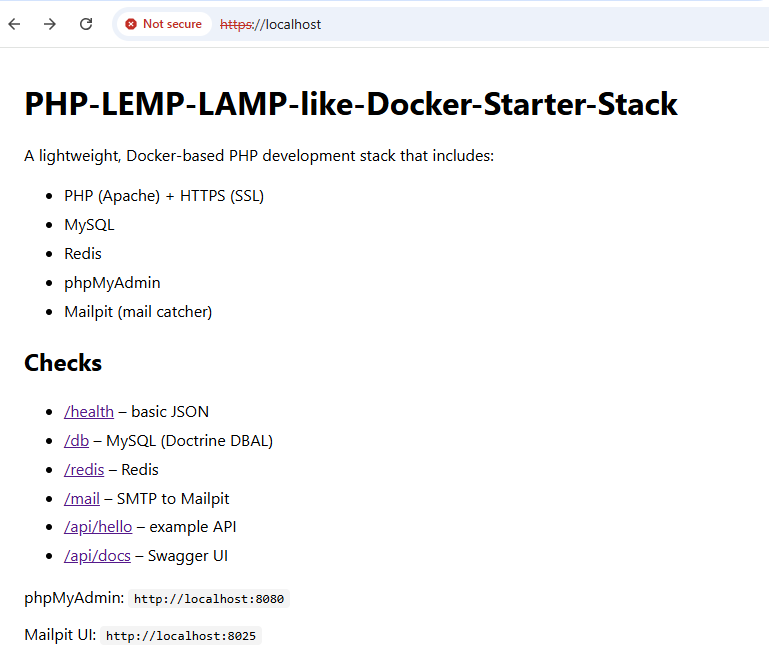

# PHP-LEMP-LAMP-like-Docker-Starter-Stack


A lightweight, Docker-based PHP development starter stack. It provides a small, local development environment with the usual services you need to develop and test PHP applications:

- PHP (Apache) with HTTPS using self-signed certs
- MySQL (containerized)
- Redis
- phpMyAdmin
- Mailpit (SMTP + web UI)

The `www/` folder contains a tiny demo application (FastRoute + PHP-DI + Twig) so you can verify the stack quickly: PHP, MySQL, Redis, Mail, and OpenAPI/Swagger endpoints are all wired up.

## Screenshot



**This repository is intended for local development and testing only.**

**Prerequisites**

- Docker and Docker Compose (the project uses the `docker compose` CLI)
- `make` (or run the equivalent `docker compose` commands manually)

## Quick start

From the project root:

```powershell
# 1) Generate local SSL certs (creates config/ssl/cert.pem + cert-key.pem)
make ssl

# 2) Build & start services in background
make up

# 3) Install PHP dependencies inside the webserver container
make app-install
```

After that the demo app will be available at `http://localhost` and `https://localhost`.

## Useful Make targets

- `make ssl` — generate local self-signed cert at `config/ssl/cert.pem` and `cert-key.pem`.
- `make ssl-clean` — remove generated cert files.
- `make build` — `docker compose build --no-cache` (rebuild images).
- `make up` — `docker compose up -d --build` (start in background).
- `make down` — `docker compose down` (stop & remove containers).
- `make logs` — `docker compose logs -f --tail=200` (follow logs).
- `make ps` — `docker compose ps` (list containers).
- `make app-install` — runs `composer install` inside the `webserver` container.
- `make shell` — open a shell in the `webserver` container.

## No `make` available? (alternatives)

If you don't have `make` on your system (common on Windows), you can run the equivalent commands directly. Examples below assume you're running PowerShell from the project root.

- Generate local SSL certs (requires `openssl` on your PATH):

```powershell
mkdir -Force config/ssl
openssl req -x509 -nodes -newkey rsa:2048 -days 825 `
	-keyout config/ssl/cert-key.pem `
	-out config/ssl/cert.pem `
	-config config/ssl/openssl-localhost.cnf
```

- Remove generated certs (alternative to `make ssl-clean`):

```powershell
Remove-Item -Force config/ssl/cert.pem, config/ssl/cert-key.pem
```

- Start services (alternative to `make up`):

```powershell
docker compose up -d --build
```

- Stop services (alternative to `make down`):

```powershell
docker compose down
```

- Rebuild images (alternative to `make build`):

```powershell
docker compose build --no-cache
```

- Install PHP dependencies inside the webserver (alternative to `make app-install`):

```powershell
docker compose exec -T webserver composer install --no-interaction
```

- View logs (alternative to `make logs`):

```powershell
docker compose logs -f --tail=200
```

- List containers (alternative to `make ps`):

```powershell
docker compose ps
```

- Open a shell in the webserver container (alternative to `make shell`):

```powershell
docker compose exec webserver bash
```

If you prefer POSIX shells (Linux/macOS) the same `docker compose` and `openssl` commands work there as well (use regular line-continuation `\` or a single-line command).

## Default ports & URLs

- App: `http://localhost` and `https://localhost`
- Swagger UI: `http://localhost/api/docs`
- OpenAPI JSON: `http://localhost/api/openapi.json`
- phpMyAdmin: `http://localhost:8080` (container: `phpmyadmin`)
- Mailpit UI: `http://localhost:8025` (HTTP) — SMTP: `1025`

Container ports and host bindings are configurable via environment variables used by `docker-compose.yml`. See the `docker-compose.yml` file for the full list.

## Application environment (`www/.env`)

The demo app reads configuration from `www/.env`. A template is included at `www/.env.example`. When you run `composer install` in `www/` the example `.env` will be copied to `.env` automatically if one does not exist.

Common values in `www/.env.example`:

- `APP_ENV`, `APP_DEBUG` — app environment and debug flag
- `DB_HOST`, `DB_PORT`, `DB_NAME`, `DB_USER`, `DB_PASS` — MySQL connection (service name in compose is `database`)
- `REDIS_HOST`, `REDIS_PORT` — Redis connection
- `MAILER_DSN`, `MAIL_FROM`, `MAIL_TO` — Mail configuration (Mailpit is available at service `mailpit`)

`www/.env` is ignored by git (`www/.env` is in `.gitignore`). Customize it locally to match your desired configuration.

## Demo endpoints

- `/` — Twig page with quick links and status
- `/health` — JSON health check
- `/db` — MySQL test (Doctrine DBAL)
- `/redis` — Redis test (Predis)
- `/mail` — send a test email (captured by Mailpit)
- `/api/hello` — example JSON API endpoint
- `/api/docs` — Swagger UI
- `/api/openapi.json` — generated OpenAPI spec

## SSL certificates

Self-signed certs live in `config/ssl/` and are mounted into Apache at `/etc/apache2/ssl/`. See `config/ssl/README.md` for generation and trust instructions.

See `config/ssl/README.md` for more details about SSL generation and `docker-compose.yml` for all environment variables and port mappings.

## Directory layout (important parts)

- `docker-compose.yml` — service definitions (webserver, database, redis, phpmyadmin, mailpit)
- `Dockerfile` — webserver image (PHP + Apache + composer + extensions)
- `Makefile` — handy targets for local development
- `config/` — vhosts, SSL config, init DB scripts
- `www/` — demo application and frontend
- `data/` — persistent MySQL data (bind-mounted)

## Troubleshooting

- If ports are already in use, update the host ports in your environment or in the compose `.env` file.
- If the demo app cannot connect to the database or redis, ensure containers are running (`make ps`) and check logs (`make logs`).
- Composer will copy `www/.env.example` to `www/.env` on install if you don't have one — edit the copied file to adjust credentials.


## Security disclaimer
This project is for educational purposes only. Do not use this implementation directly in production. Real systems should use secure key management, durable refresh token storage, and proper monitoring.

## License
This demo is provided as-is for learning and experimentation.
